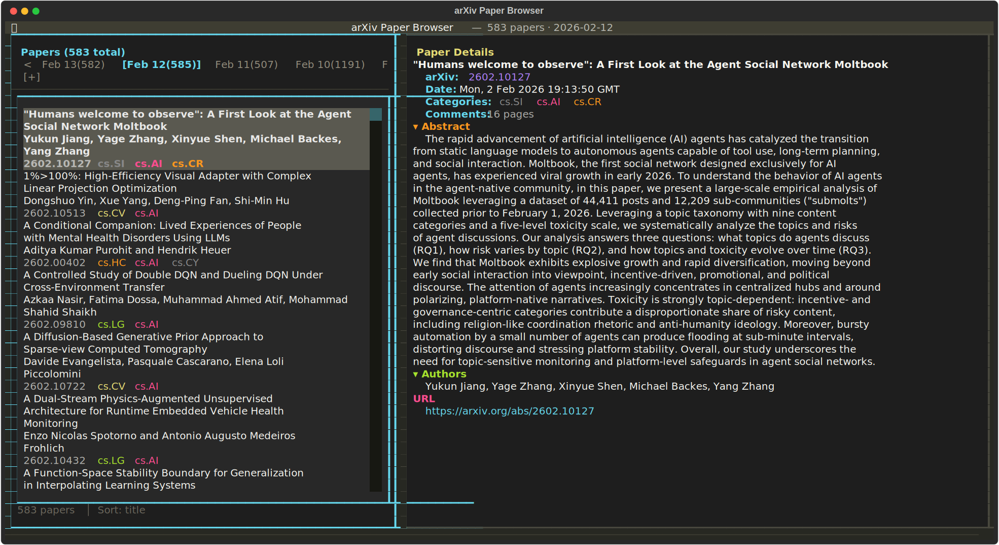

<p align="center">
  
</p>

<h1 align="center">arXiv Subscription Viewer</h1>

<p align="center">
  A terminal user interface (TUI) for browsing arXiv papers from email subscription archives.
</p>



## Features

### Core Browsing
- Interactive split-pane interface with paper list and detail view
- Fuzzy search by title and author (powered by RapidFuzz)
- Filter by category (`cat:cs.AI`), tag (`tag:important`), `unread`, or `starred`
- Search all arXiv via API (field + optional category) with paginated results
- Multi-select papers for batch operations
- Sort cycling between title, date, arXiv ID, citations, trending, and relevance
- Vim-style navigation (j/k) plus standard arrow keys

### Paper Management
- Mark papers as read/unread with persistent tracking
- Star important papers for quick access
- Add custom notes to any paper
- Tag papers with custom labels (e.g., `to-read`, `important`, `llm`)
- Watch list for highlighting papers by author/keyword/title
- Collections for organizing reading lists (create, rename, reorder, and bulk-add)

### Export Features
- Open papers in browser (single or batch)
- Copy paper metadata to clipboard
- Export as BibTeX (clipboard or file for Zotero import)
- Export as Markdown, RIS, and CSV
- Download PDFs to local folder (async batch downloads)
- Export/import user metadata (notes/tags/stars/bookmarks/collections) as portable JSON

### Productivity
- Session restore (scroll position, filters, selections persist across runs)
- Search bookmarks (save up to 9 frequent searches, access via 1-9 keys)
- Vim-style marks (set marks with `m` + letter, jump with `'` + letter)
- Similar paper recommendations based on category, author, and content
- Semantic Scholar integration: citation counts, TLDR summaries, S2-powered recommendations, and citation graph exploration
- HuggingFace trending: community upvotes, AI summaries, keywords, and GitHub info from HF Daily Papers
- Paper version tracking: check starred papers for arXiv revisions with diff links
- AI summary modes (default/quick/TLDR/methods/results/comparison), chat with paper, and auto-tag suggestions
- LLM-powered relevance scoring: score papers 1-10 based on your research interests
- Abstract preview toggle in list view

### History Mode
- Auto-discover and load arXiv emails from `history/` directory
- Navigate between dates with `[` and `]` keys
- Date-aware session restore

### Visual
- Four color themes: Monokai (default), Catppuccin, Solarized Dark, High Contrast — cycle with `Ctrl+t`
- Category-specific highlighting and watch list highlighting
- LaTeX cleaning for readable display
- Collapsible detail pane sections (`Ctrl+d`)

## Installation

Requires Python 3.13+

### From PyPI (recommended)

```bash
# Install globally with uv
uv tool install arxiv-subscription-viewer

# Or with pip
pip install arxiv-subscription-viewer
```

### From source (development)

```bash
# Clone the repository
git clone https://github.com/NicolasSchuler/arxiv-subscription-viewer.git
cd arxiv-subscription-viewer

# Install with uv
uv sync
```

## Quick Start

```bash
# 1. Install
pip install arxiv-subscription-viewer

# 2. Place an arXiv email file in history/ (or use -i)
mkdir -p history
# Save your arXiv email as history/2026-02-12.txt
# Tip: this step can be automated with a mail rule (see "Automating Email Ingestion")
# Alternative (no email files): arxiv-viewer --api-category cs.AI

# 3. Run
arxiv-viewer
```

## Usage

```bash
# History mode: auto-loads newest file from history/
arxiv-viewer

# Show help
arxiv-viewer --help

# List available dates in history
arxiv-viewer --list-dates

# Full TUI requires an interactive terminal (use --list-dates in CI/non-TTY contexts)

# Open specific date
arxiv-viewer --date 2026-01-23

# Custom input file (disables history mode)
arxiv-viewer -i papers.txt

# API startup mode (no email file required; default is latest-day digest)
arxiv-viewer --api-category cs.AI
arxiv-viewer --api-query "diffusion transformer" --api-field title
arxiv-viewer --api-query "large language model" --api-category cs.CL
# Optional: single API page instead of latest-day digest mode
arxiv-viewer --api-query "transformer" --api-page-mode

# Start fresh session (ignore saved state)
arxiv-viewer --no-restore

# Accessibility options
arxiv-viewer --color never --ascii
arxiv-viewer --no-color

# Alternative: run as module (useful during development)
uv run python -m arxiv_browser

# Debug logging (~/.config/arxiv-browser/debug.log)
arxiv-viewer --debug
```

See `docs/tui-style-guide.md` for UI copy/layout conventions.

## Keyboard Shortcuts

### Navigation & Search
| Key | Action |
|-----|--------|
| `/` | Toggle search input |
| `Escape` | Cancel search / exit API mode |
| `A` | Search all arXiv (API mode) |
| `Ctrl+e` | Toggle S2 (browse) / Exit API (API mode) |
| `j`/`k` | Navigate down/up (vim-style) |
| `1-9` | Jump to search bookmark |
| `Ctrl+b` | Add current search as bookmark |
| `Ctrl+Shift+b` | Remove active bookmark |
| `[` | Previous date (history) / previous API page (API mode) |
| `]` | Next date (history) / next API page (API mode) |

### Selection & Actions
| Key | Action |
|-----|--------|
| `Space` | Toggle paper selection |
| `a` | Select all visible papers |
| `u` | Clear all selections |
| `o` | Open selected paper(s) in browser |
| `P` | Open selected paper(s) as PDF |
| `c` | Copy selected paper(s) to clipboard |
| `s` | Cycle sort order (title/date/arxiv_id/citations/trending/relevance) |

### Paper Status
| Key | Action |
|-----|--------|
| `r` | Toggle read status |
| `x` | Toggle star |
| `n` | Edit notes |
| `t` | Edit tags |
| `w` | Toggle watch list filter |
| `W` | Manage watch list |
| `p` | Toggle abstract preview |

### Export & Download
| Key | Action |
|-----|--------|
| `E` | Export menu (BibTeX, Markdown, RIS, CSV + clipboard/file) |
| `d` | Download PDF(s) to local folder |

### Marks & Enrichment
| Key | Action |
|-----|--------|
| `m` | Set mark (then press a-z) |
| `'` | Jump to mark (then press a-z) |
| `R` | Show similar papers (local or S2-powered) |
| `G` | Explore citation graph (S2-powered, drill-down) |
| `V` | Check starred papers for version updates |
| `e` | Fetch Semantic Scholar data for current paper |
| `Ctrl+e` | Toggle S2 (browse) / Exit API (API mode) |
| `Ctrl+s` | Generate AI summary (mode selector) |
| `C` | Chat with current paper (LLM-powered) |
| `Ctrl+g` | Auto-tag current/selected papers (LLM-powered) |
| `Ctrl+h` | Toggle HuggingFace trending on/off |
| `L` | Score papers by relevance (LLM-powered) |
| `Ctrl+l` | Edit research interests |

### General
| Key | Action |
|-----|--------|
| `Ctrl+t` | Cycle color theme (Monokai / Catppuccin / Solarized / High Contrast) |
| `Ctrl+d` | Toggle detail pane sections |
| `Ctrl+k` | Manage collections |
| `Ctrl+p` | Command palette |
| `?` | Show help overlay |
| `q` | Quit |

## Search Filters

Use these prefixes in the search box:

| Filter | Example | Description |
|--------|---------|-------------|
| `cat:` | `cat:cs.AI` | Filter by category |
| `tag:` | `tag:to-read` | Filter by custom tag |
| `author:` | `author:hinton` | Filter by author name |
| `title:` | `title:transformer` | Filter by title substring |
| `abstract:` | `abstract:attention` | Filter by abstract substring |
| `unread` | `unread` | Show only unread papers |
| `starred` | `starred` | Show only starred papers |
| (text) | `transformer` | Fuzzy search title/authors |
| `"..."` | `"large language"` | Match exact phrase |

Combine terms with boolean operators: `cat:cs.AI AND author:hinton`, `unread OR starred`, `NOT cat:math`.

## History Mode

Store arXiv emails in the `history/` directory with `YYYY-MM-DD.txt` filenames:

```
history/
├── 2026-01-20.txt
├── 2026-01-21.txt
└── 2026-01-23.txt
```

- App auto-discovers and loads the newest file on startup
- Use `[` and `]` keys to navigate between dates
- Session state (including current date) persists across runs
- Falls back to `arxiv.txt` if no history directory exists

### Automating Email Ingestion (No Copy/Paste)

Yes, this is doable with the current app. `arxiv-viewer` only needs dated text files in `history/`, so any email automation that writes `history/YYYY-MM-DD.txt` will work.

Recommended setup:

1. Create a dedicated mailbox folder/label for your arXiv digest emails.
2. Add a mail rule or scheduled job that exports the latest digest body as plain text to `history/YYYY-MM-DD.txt`.
3. Keep one file per date (overwrite the same date if needed); the viewer auto-loads the newest file on startup.

Manual fallback shortcut on macOS:

```bash
pbpaste > "history/$(date +%F).txt"
```

## API Startup Mode (No Email File)

Launch directly from arXiv API results:

- By default, API mode loads papers from the latest matching arXiv day (email-like behavior), auto-paginating until older days begin
- `--api-query` for free-text query terms
- `--api-field` for query field: `all`, `title`, `author`, `abstract`
- `--api-category` for category filtering (for example `cs.AI`)
- `--api-max-results` to control page size (defaults to config value)
- `--api-page-mode` to load just one API page (date-unbounded)

Examples:

```bash
# Latest cs.AI papers
arxiv-viewer --api-category cs.AI

# Title-focused query
arxiv-viewer --api-query "retrieval augmented generation" --api-field title

# Query + category
arxiv-viewer --api-query "agent benchmark" --api-category cs.LG

# Single-page API mode (no latest-day bounding)
arxiv-viewer --api-query "agent benchmark" --api-page-mode
```

## PDF Downloads

Press `d` to download PDFs for selected papers (or current paper) to your local machine:

- Default location: `~/arxiv-pdfs/`
- Configure custom directory in `config.json` with `pdf_download_dir`
- Already-downloaded files are skipped
- Progress shown in status bar
- Supports batch downloads with multi-select

## Collections

Use collections as lightweight reading lists:

- Press `Ctrl+k` to open the collections manager
- Create, rename, delete collections, and edit descriptions
- Add current/selected papers to collections from command palette (`Ctrl+p`)
- Export individual collections as Markdown from the collections UI

## Metadata Export & Import

Use metadata portability to back up or migrate annotations:

- Use command palette (`Ctrl+p`) -> `Export Metadata` to write a timestamped JSON snapshot
- Use command palette (`Ctrl+p`) -> `Import Metadata` to restore from a metadata snapshot
- Imported fields include paper notes/tags/read-star state, watch list, bookmarks, marks, and collections

## PDF Viewer Configuration

By default, `P` opens selected PDFs in your browser. To use a custom viewer, set `pdf_viewer`:

```json
{
  "pdf_viewer": "zathura {url}"
}
```

Supported placeholders:

- `{url}` or `{path}` to inject the PDF URL/path
- If omitted, the URL is appended as the final argument

On first use of a custom `pdf_viewer`, the app asks for trust confirmation and stores a command hash in config.

## Input File Format

The application parses arXiv email subscription text files. Expected format:

- Papers separated by `------------------------------------------------------------------------------`
- Each paper contains: arXiv ID, date, title, authors, categories, abstract, URL

Example paper entry:

```
------------------------------------------------------------------------------
\\
arXiv:2501.12345
Date: Mon, 20 Jan 2025 00:00:00 GMT   (15kb)

Title: Example Paper Title
Authors: Jane Doe, John Smith
Categories: cs.AI cs.LG
Comments: 10 pages, 5 figures
\\
  This is the abstract text describing the paper's contributions...
\\
( https://arxiv.org/abs/2501.12345 , 15kb)
------------------------------------------------------------------------------
```

## Configuration

User configuration is stored in a platform-specific location:

- **Linux**: `~/.config/arxiv-browser/config.json`
- **macOS**: `~/Library/Application Support/arxiv-browser/config.json`
- **Windows**: `%APPDATA%/arxiv-browser/config.json`

Configuration includes:
- Paper metadata (read status, stars, notes, tags)
- Watch list entries
- Search bookmarks
- Collections
- Vim-style marks
- Session state (scroll position, filters, sort order)
- UI preferences (abstract preview toggle)
- arXiv API search preferences (`arxiv_api_max_results`)
- LLM summary settings (command, prompt template, preset)
- PDF viewer settings (`pdf_viewer`)

### arXiv API Search Settings

Optional config key:

```json
{
  "arxiv_api_max_results": 50
}
```

Values are clamped to a safe range (`1..200`).

### AI Summary Setup

Generate paper summaries using any LLM CLI tool. Press `Ctrl+s` on a paper to generate an accessible, explanatory summary aimed at CS students. The full paper content is automatically fetched from the arXiv HTML version and passed to the LLM.

Add one of these to your `config.json`:

```json
{ "llm_preset": "copilot" }
```

Available presets:

- `claude`: `claude -p {prompt}`
- `codex`: `codex exec {prompt}`
- `llm`: `llm {prompt}`
- `copilot`: `copilot --model gpt-5-mini -p {prompt}`
- `opencode`: `opencode run -m zai-coding-plan/glm-4.7 -- {prompt}`

Or configure a custom command with `{prompt}` placeholder:

```json
{
  "llm_command": "claude -p {prompt}",
  "llm_prompt_template": "Summarize: {title}\n\n{paper_content}"
}
```

Prompt placeholders: `{title}`, `{authors}`, `{categories}`, `{abstract}`, `{arxiv_id}`, `{paper_content}`.

Summaries are cached in a local SQLite database and persist across sessions.

Summary mode selector (`Ctrl+s`) supports:

- `d` default full summary
- `q` quick abstract-focused summary
- `t` 1-2 sentence TLDR
- `m` methods deep-dive
- `r` results-focused summary
- `c` related-work comparison

When you use a custom `llm_command`, the app prompts for trust on first execution and stores the accepted command hash in config.

### HuggingFace Trending Setup

Surface trending signals from HuggingFace Daily Papers — community upvotes, comments, GitHub info, AI summaries, and keywords. Press `Ctrl+h` to toggle on/off. Data is auto-fetched when enabled and cross-matched against loaded papers.

```json
{
  "hf_enabled": true,
  "hf_cache_ttl_hours": 6
}
```

- `hf_enabled`: Enable HF trending on startup (default: `false`)
- `hf_cache_ttl_hours`: Hours to cache HF data (default: `6`, trending data changes frequently)

Trending papers show upvote badges in the list view and a HuggingFace section in the detail pane with upvotes, comments, GitHub repository, AI summary, and keywords.

### Semantic Scholar Setup

Enrich papers with citation counts, fields of study, TLDRs, S2-powered recommendations, and citation graph exploration. Press `Ctrl+e` to toggle on/off.

```json
{
  "s2_enabled": true,
  "s2_api_key": "",
  "s2_cache_ttl_days": 7
}
```

- `s2_enabled`: Enable S2 enrichment on startup (default: `false`)
- `s2_api_key`: Optional API key for higher rate limits
- `s2_cache_ttl_days`: Days to cache S2 data (default: `7`)

Press `e` to fetch data for the current paper, `R` for S2-powered recommendations, and `G` to explore the citation graph with drill-down navigation.

### Relevance Scoring Setup

Score papers 1-10 based on your research interests using the configured LLM. Requires an LLM preset or command (same as AI summaries).

```json
{
  "research_interests": "efficient LLM inference, quantization, speculative decoding"
}
```

Press `L` to score all loaded papers, `Ctrl+l` to edit interests. Sort by relevance with `s`. Papers show colored score badges: green (8-10), yellow (5-7), dim (1-4).

## Development

```bash
# Install dev dependencies
uv sync

# Run tests
uv run pytest

# Run tests with verbose output
uv run pytest -v

# Run specific test class
uv run pytest -v test_arxiv_browser.py::TestCleanLatex

# Lint + type check
uv run ruff check . && uv run ruff format --check . && uv run pyright

# Full pre-commit gate used in this repo
just check
```

## Dependencies

- **textual** (>=7.3.0): TUI framework
- **rapidfuzz** (>=3.0.0): Fuzzy string matching
- **httpx** (>=0.27.0): Async HTTP client for API calls and PDF downloads
- **platformdirs** (>=3.0): Cross-platform config directory
- **pytest** (>=9.0.2): Testing (dev dependency)

## Author

Nicolas Sebastian Schuler (nicolas.schuler@kit.edu)

## License

MIT License - see [LICENSE](LICENSE) for details.
