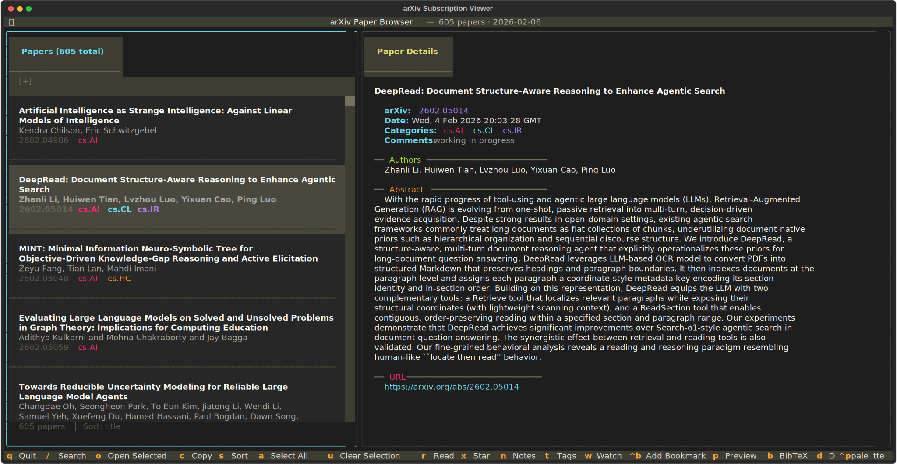

# arXiv Subscription Viewer

A terminal user interface (TUI) for browsing arXiv papers from email subscription archives.



## Features

### Core Browsing
- Interactive split-pane interface with paper list and detail view
- Fuzzy search by title and author (powered by RapidFuzz)
- Filter by category (`cat:cs.AI`), tag (`tag:important`), `unread`, or `starred`
- Multi-select papers for batch operations
- Sort cycling between title, date, and arXiv ID
- Vim-style navigation (j/k) plus standard arrow keys

### Paper Management
- Mark papers as read/unread with persistent tracking
- Star important papers for quick access
- Add custom notes to any paper
- Tag papers with custom labels (e.g., `to-read`, `important`, `llm`)
- Watch list for highlighting papers by author/keyword/title

### Export Features
- Open papers in browser (single or batch)
- Copy paper metadata to clipboard
- Export as BibTeX (clipboard or file for Zotero import)
- Export as Markdown
- Download PDFs to local folder (async batch downloads)

### Productivity
- Session restore (scroll position, filters, selections persist across runs)
- Search bookmarks (save up to 9 frequent searches, access via 1-9 keys)
- Vim-style marks (set marks with `m` + letter, jump with `'` + letter)
- Similar paper recommendations based on category, author, and content
- Abstract preview toggle in list view

### History Mode
- Auto-discover and load arXiv emails from `history/` directory
- Navigate between dates with `[` and `]` keys
- Date-aware session restore

### Visual
- Monokai color theme with category-specific highlighting
- LaTeX cleaning for readable display
- Watch list highlighting for tracked authors/keywords

## Installation

Requires Python 3.13+

```bash
# Clone the repository
git clone https://github.com/nschuler/arxiv-subscription-viewer.git
cd arxiv-subscription-viewer

# Install with uv
uv sync
```

## Usage

```bash
# History mode: auto-loads newest file from history/
uv run python arxiv_browser.py

# List available dates in history
uv run python arxiv_browser.py --list-dates

# Open specific date
uv run python arxiv_browser.py --date 2026-01-23

# Custom input file (disables history mode)
uv run python arxiv_browser.py -i papers.txt

# Start fresh session (ignore saved state)
uv run python arxiv_browser.py --no-restore
```

## Keyboard Shortcuts

### Navigation & Search
| Key | Action |
|-----|--------|
| `/` | Toggle search input |
| `Escape` | Cancel search |
| `j`/`k` | Navigate down/up (vim-style) |
| `1-9` | Jump to search bookmark |
| `Ctrl+b` | Add current search as bookmark |
| `[` | Go to previous (older) date (history mode) |
| `]` | Go to next (newer) date (history mode) |

### Selection & Actions
| Key | Action |
|-----|--------|
| `Space` | Toggle paper selection |
| `a` | Select all visible papers |
| `u` | Clear all selections |
| `o` | Open selected paper(s) in browser |
| `c` | Copy selected paper(s) to clipboard |
| `s` | Cycle sort order (title/date/arxiv_id) |

### Paper Status
| Key | Action |
|-----|--------|
| `r` | Toggle read status |
| `x` | Toggle star |
| `n` | Edit notes |
| `t` | Edit tags |
| `w` | Toggle watch list filter |
| `p` | Toggle abstract preview |

### Export
| Key | Action |
|-----|--------|
| `b` | Copy as BibTeX |
| `B` | Export BibTeX to file (for Zotero) |
| `d` | Download PDF(s) to local folder |
| `M` | Copy as Markdown |

### Marks & Similar Papers
| Key | Action |
|-----|--------|
| `m` | Set mark (then press a-z) |
| `'` | Jump to mark (then press a-z) |
| `R` | Show similar papers |
| `Ctrl+s` | Generate AI summary |

### General
| Key | Action |
|-----|--------|
| `q` | Quit |

## Search Filters

Use these prefixes in the search box:

| Filter | Example | Description |
|--------|---------|-------------|
| `cat:` | `cat:cs.AI` | Filter by category |
| `tag:` | `tag:to-read` | Filter by custom tag |
| `unread` | `unread` | Show only unread papers |
| `starred` | `starred` | Show only starred papers |
| (text) | `transformer` | Fuzzy search title/authors |

## History Mode

Store arXiv emails in the `history/` directory with `YYYY-MM-DD.txt` filenames:

```
history/
├── 2026-01-20.txt
├── 2026-01-21.txt
└── 2026-01-23.txt
```

- App auto-discovers and loads the newest file on startup
- Use `[` and `]` keys to navigate between dates
- Session state (including current date) persists across runs
- Falls back to `arxiv.txt` if no history directory exists
- Limited to 365 most recent files to prevent memory issues

## PDF Downloads

Press `d` to download PDFs for selected papers (or current paper) to your local machine:

- Default location: `~/arxiv-pdfs/`
- Configure custom directory in `config.json` with `pdf_download_dir`
- Already-downloaded files are skipped
- Progress shown in status bar
- Supports batch downloads with multi-select

## Input File Format

The application parses arXiv email subscription text files. Expected format:

- Papers separated by `------------------------------------------------------------------------------`
- Each paper contains: arXiv ID, date, title, authors, categories, abstract, URL

Example paper entry:

```
------------------------------------------------------------------------------
\\
arXiv:2501.12345
Date: Mon, 20 Jan 2025 00:00:00 GMT   (15kb)

Title: Example Paper Title
Authors: Jane Doe, John Smith
Categories: cs.AI cs.LG
Comments: 10 pages, 5 figures
\\
  This is the abstract text describing the paper's contributions...
\\
( https://arxiv.org/abs/2501.12345 , 15kb)
------------------------------------------------------------------------------
```

## Configuration

User configuration is stored in a platform-specific location:

- **Linux**: `~/.config/arxiv-browser/config.json`
- **macOS**: `~/Library/Application Support/arxiv-browser/config.json`
- **Windows**: `%APPDATA%/arxiv-browser/config.json`

Configuration includes:
- Paper metadata (read status, stars, notes, tags)
- Watch list entries
- Search bookmarks
- Vim-style marks
- Session state (scroll position, filters, sort order)
- UI preferences (abstract preview toggle)
- LLM summary settings (command, prompt template, preset)

### AI Summary Setup

Generate paper summaries using any LLM CLI tool. Press `Ctrl+s` on a paper to generate a structured analysis. The full paper content is automatically fetched from the arXiv HTML version and passed to the LLM.

Add one of these to your `config.json`:

```json
{ "llm_preset": "copilot" }
```

Available presets: `claude` (`claude -p`), `codex` (`codex exec`), `llm` (`llm`), `copilot` (`copilot -p`).

Or configure a custom command with `{prompt}` placeholder:

```json
{
  "llm_command": "claude -p {prompt}",
  "llm_prompt_template": "Summarize: {title}\n\n{paper_content}"
}
```

Prompt placeholders: `{title}`, `{authors}`, `{categories}`, `{abstract}`, `{arxiv_id}`, `{paper_content}`.

Summaries are cached in a local SQLite database and persist across sessions.

## Development

```bash
# Run tests
uv run pytest

# Run tests with verbose output
uv run pytest -v

# Run specific test class
uv run pytest -v test_arxiv_browser.py::TestCleanLatex
```

## Dependencies

- **textual** (>=7.3.0): TUI framework
- **rapidfuzz** (>=3.0.0): Fuzzy string matching
- **platformdirs**: Cross-platform config directory (transitive via textual)
- **pytest** (>=9.0.2): Testing (dev dependency)

## Author

Nicolas Sebastian Schuler (nicolas.schuler@kit.edu)

## License

MIT License - see [LICENSE](LICENSE) for details.
