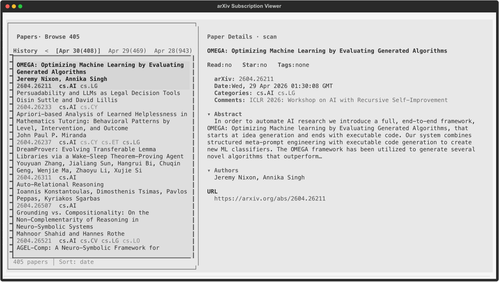

<p align="center">
  
</p>

<h1 align="center">arXiv Subscription Viewer</h1>

<p align="center">
  <b>Triage arXiv papers from your terminal.</b><br>
  History mode or live API search · keyboard-first review · optional citation and LLM enrichment
</p>

<p align="center">
  
</p>

<p align="center">
  <a href="https://github.com/NicolasSchuler/arxiv-subscription-viewer/actions/workflows/ci-cd.yml">
    
  </a>
  <a href="https://pypi.org/project/arxiv-subscription-viewer/">
    
  </a>
  <a href="https://pypi.org/project/arxiv-subscription-viewer/">
    
  </a>
  <a href="LICENSE">
    
  </a>
</p>

## 🚀 Getting Started

Use whichever entry path matches how you already follow papers:

- **`history/` workflow**: review local daily digests with persistent date navigation, bookmarks, notes, and collections.
- **Live arXiv search**: start directly from the API when you want the newest matching papers without preparing local files first.

```bash
# Confirm Python support
python3.13 --version

# Install as a CLI tool
uv tool install arxiv-subscription-viewer
# or: python3.13 -m pip install --user arxiv-subscription-viewer

# Optional faster fuzzy matching
uv tool install "arxiv-subscription-viewer[fuzzy]"

# Check environment & config health
arxiv-viewer doctor

# Search arXiv API directly
arxiv-viewer search --category cs.AI

# Search by topic
arxiv-viewer search --query "diffusion transformer" --field title

# Paginate through results (instead of collecting the newest day)
arxiv-viewer search --query "attention" --mode page --max-results 100

# Generate a cron-friendly Markdown digest
arxiv-viewer digest --category cs.AI --period weekly --output digest.md

# Browse from a local history/ archive (see docs/history-mode.md)
arxiv-viewer browse

# List local history dates
arxiv-viewer dates

# Show version
arxiv-viewer --version

# Print config file path
arxiv-viewer config-path

# Module entrypoint, equivalent to arxiv-viewer
python -m arxiv_browser --version
```

> **Requires Python 3.13+** · Press `?` in-app for help · `Ctrl+p` opens commands
>
> Global options: `--version` · `--debug` (log to file) · `--ascii` (ASCII-only icons) · `--color auto|always|never` · `--no-color` · `--theme {monokai|catppuccin-mocha|solarized-dark|solarized-light|high-contrast}`
>
> Debug log paths: `~/.config/arxiv-browser/debug.log` (Linux) · `~/Library/Application Support/arxiv-browser/debug.log` (macOS) · `%APPDATA%/arxiv-browser/debug.log` (Windows)

## 🧭 Choose A Workflow

### `history/` archive

Run the viewer from the directory that contains your `history/` folder:

```bash
mkdir -p ~/research/arxiv/history
cd ~/research/arxiv
# Save a digest as history/2026-02-13.txt
arxiv-viewer
```

This path is best when you review daily digests in order and want persistent local state.

### Live arXiv search

Use the API-first path when you want to start from current arXiv results:

```bash
arxiv-viewer search --category cs.AI
arxiv-viewer search --query "diffusion transformer" --field title
```

If something looks off, run `arxiv-viewer doctor` to check config, history discovery, CLI setup, and environment assumptions.

## ✨ Highlights

| | Feature | Key |
|---|---------|-----|
| 🔍 | **Fuzzy search** with filters (`cat:cs.AI`, `tag:`, `unread`, `starred`) | `/` |
| ⚡ | **Quick triage** — review visible unread papers one at a time | `T` |
| 📈 | **Trend Radar & author profiles** — local history trends and exact author tracking | `Ctrl+p` |
| 🤖 | **AI summaries, chat, comparison, paper remix & auto-tag** via any LLM CLI (Claude, Copilot, llm, …) | `Ctrl+s` / `C` / `Ctrl+v` / `Ctrl+p` / `Ctrl+g` |
| 📊 | **Citation graph** and recommendations via Semantic Scholar | `G` / `R` |
| 🔥 | **HuggingFace trending** — upvotes, keywords, GitHub links | `Ctrl+h` |
| 🧭 | **Smart Reading Queue** — priority sort from relevance, watch matches, recency, HF, and S2 signals | `s` |
| 🧪 | **Local triage model** — sklearn buckets for likely stars, unsure papers, and likely skips | `Ctrl+p` |
| 📨 | **Markdown digests** — cron-friendly daily/weekly briefs | `arxiv-viewer digest` |
| 🏷️ | **Tags, notes, stars** — organize your reading | `t` / `n` / `x` |
| 📁 | **Collections** — curate reading lists | `Ctrl+k` |
| 📥 | **Export** — BibTeX, Markdown, RIS, CSV, PDF download/preview | `E` / `d` / `F` |
| 🖼️ | **HTML figure preview** — render the first arXiv HTML figure in-terminal | `I` |
| 🔊 | **Audio abstract reading** — read the current abstract aloud with system TTS | `y` |
| 🎯 | **Relevance scoring** — LLM scores papers against your interests | `L` |
| 📅 | **History mode** — navigate daily email digests with `[` / `]` | |
| ⌨️ | **Command palette** — quick access to all commands | `Ctrl+p` |
| 🎨 | **4 themes** — Monokai, Catppuccin, Solarized, High Contrast | `Ctrl+t` |

## ⌨️ Key Bindings

| Key | Action | | Key | Action |
|-----|--------|-|-----|--------|
| `/` | Search | | `o` | Open in browser |
| `A` | Search arXiv API | | `P` | Open PDF |
| `j` / `k` | Navigate | | `d` | Download PDF |
| `Space` | Select | | `F` | Preview PDF |
| `s` | Cycle sort | | `I` | Preview first figure |
| `r` | Toggle read | | `E` | Export menu |
| `x` | Toggle star | | `c` | Copy to clipboard |
| `T` | Quick triage | | `Ctrl+s` | AI summary |
| `n` | Notes | | `Ctrl+k` | Collections |
| `Ctrl+v` | Compare papers | | `C` | Chat with paper |
| `p` | Abstract preview | | `y` | Read abstract aloud |
| `L` | Relevance score | | `t` | Tags |
| `Ctrl+p` | Command palette | | `V` | Check versions |
| `Ctrl+g` | Auto-tag (LLM) | | `Ctrl+b` | Save bookmark |
| `G` | Citation graph | | `m` / `'` | Set / jump to mark |
| `R` | Recommendations | | `Ctrl+l` | Edit interests |
| `1-9` | Jump to bookmark | | `Ctrl+d` | Detail pane sections |
| `w` / `W` | Watch list | | `v` | Detail mode |
| `Ctrl+e` | Toggle S2 / Exit API mode | | `Ctrl+r` | Mark visible as read |
| `Ctrl+h` | HuggingFace trending | | `Ctrl+Shift+b` | Remove bookmark |
| | | | `?` | Help / shortcuts |

### Marks

Press `m` followed by a letter (`a`–`z`) to set a named mark at the current paper.
Press `'` followed by that letter to jump back to it. Marks persist within a session,
making it easy to navigate between papers you're comparing or revisiting.

## ⚙️ Configuration

Config lives at `~/.config/arxiv-browser/config.json` (Linux), `~/Library/Application Support/arxiv-browser/config.json` (macOS), or `%APPDATA%/arxiv-browser/config.json` (Windows).

If you want the best documentation entry point for your context:

- 🌐 **Published guide hub**: [nicolasschuler.github.io/arxiv-subscription-viewer](https://nicolasschuler.github.io/arxiv-subscription-viewer/)
- 📚 **Repository docs index**: [docs/README.md](docs/README.md)
- ⚙️ **Direct config reference**: [docs/config-reference.md](docs/config-reference.md)

See the **[full documentation](docs/)** for:

- 🧭 [Docs start page](docs/README.md)
- 🌐 [Published docs landing page](https://nicolasschuler.github.io/arxiv-subscription-viewer/)
- ⚙️ [Configuration reference](docs/config-reference.md)
- 🤖 [AI summary & LLM setup](docs/llm-setup.md)
- 📊 [Semantic Scholar integration](docs/semantic-scholar.md)
- 🔥 [HuggingFace trending](docs/huggingface.md)
- 📅 [History mode & email ingestion](docs/history-mode.md)
- 🔍 [Search filters & advanced queries](docs/search-filters.md)
- 📥 [Export & PDF configuration](docs/export.md)
- 🛠️ [Troubleshooting](docs/troubleshooting.md)

## 🐚 Shell Completions

Enable tab completion for subcommands and flags:

```bash
# Bash (add to ~/.bashrc)
eval "$(arxiv-viewer completions bash)"

# Zsh (add to ~/.zshrc)
eval "$(arxiv-viewer completions zsh)"

# Fish (add to ~/.config/fish/config.fish)
arxiv-viewer completions fish | source
```

## 🔄 Upgrade / Uninstall

```bash
uv tool upgrade arxiv-subscription-viewer
uv tool uninstall arxiv-subscription-viewer

# pip-installed users
python3.13 -m pip install --user --upgrade arxiv-subscription-viewer
python3.13 -m pip uninstall arxiv-subscription-viewer
```

## 🛠️ Development

```bash
git clone https://github.com/NicolasSchuler/arxiv-subscription-viewer.git
cd arxiv-subscription-viewer
uv python install 3.13
uv sync --locked
pre-commit install
just check   # docs drift + lint + typechecks + tests
just quality # full local quality suite
```

For contributor-oriented architecture and import-boundary guidance, start with [docs/architecture.md](docs/architecture.md).

## 📄 License

MIT — [Nicolas Sebastian Schuler](mailto:nicolas.schuler@kit.edu)
