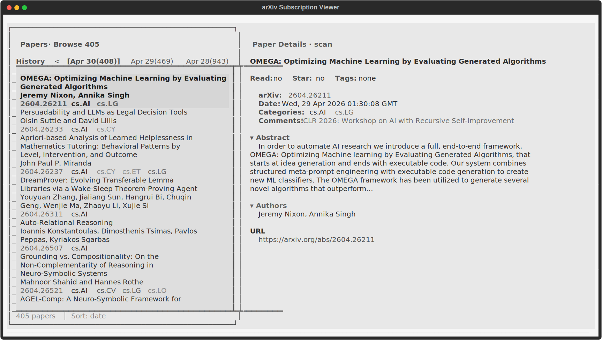

<p align="center">
  
</p>

<h1 align="center">arXiv Subscription Viewer</h1>

<p align="center">
  <b>Browse, search, and manage arXiv papers from your terminal.</b><br>
  Fuzzy search · AI summaries · citation graphs · PDF downloads · export to BibTeX/Markdown/CSV
</p>

<p align="center">
  
</p>

## 🚀 Getting Started

```bash
# Install
pip install arxiv-subscription-viewer
# or: uv tool install arxiv-subscription-viewer

# Browse latest cs.AI papers
arxiv-viewer --api-category cs.AI

# Search by topic
arxiv-viewer --api-query "diffusion transformer" --api-field title

# Browse from email digest files (see docs/history-mode.md)
arxiv-viewer
```

> **Requires Python 3.13+** · Press `?` in-app for help · `Ctrl+p` opens the command palette

## ✨ Highlights

| | Feature | Key |
|---|---------|-----|
| 🔍 | **Fuzzy search** with filters (`cat:cs.AI`, `tag:`, `unread`, `starred`) | `/` |
| 🤖 | **AI summaries & chat** via any LLM CLI (Claude, Copilot, llm, …) | `Ctrl+s` / `C` |
| 📊 | **Citation graph** and recommendations via Semantic Scholar | `G` / `R` |
| 🔥 | **HuggingFace trending** — upvotes, keywords, GitHub links | `Ctrl+h` |
| 🏷️ | **Tags, notes, stars** — organize your reading | `t` / `n` / `x` |
| 📁 | **Collections** — curate reading lists | `Ctrl+k` |
| 📥 | **Export** — BibTeX, Markdown, RIS, CSV, PDF download | `E` / `d` |
| 🎯 | **Relevance scoring** — LLM scores papers against your interests | `L` |
| 📅 | **History mode** — navigate daily email digests with `[` / `]` | |
| 🎨 | **4 themes** — Monokai, Catppuccin, Solarized, High Contrast | `Ctrl+t` |

## ⌨️ Key Bindings

| Key | Action | | Key | Action |
|-----|--------|-|-----|--------|
| `/` | Search | | `o` | Open in browser |
| `A` | Search arXiv API | | `P` | Open PDF |
| `j` / `k` | Navigate | | `d` | Download PDF |
| `Space` | Select | | `E` | Export menu |
| `s` | Cycle sort | | `c` | Copy to clipboard |
| `r` | Toggle read | | `Ctrl+s` | AI summary |
| `x` | Toggle star | | `C` | Chat with paper |
| `n` | Notes | | `L` | Relevance score |
| `t` | Tags | | `G` | Citation graph |
| `V` | Check versions | | `R` | Recommendations |
| `Ctrl+p` | Command palette | | `?` | Help |
| `Ctrl+e` | Toggle S2 | | `q` | Quit |

## ⚙️ Configuration

Config lives at `~/.config/arxiv-browser/config.json` (Linux), `~/Library/Application Support/arxiv-browser/config.json` (macOS), or `%APPDATA%/arxiv-browser/config.json` (Windows).

See the **[full documentation](docs/)** for:

- 🤖 [AI summary & LLM setup](docs/llm-setup.md)
- 📊 [Semantic Scholar integration](docs/semantic-scholar.md)
- 🔥 [HuggingFace trending](docs/huggingface.md)
- 📅 [History mode & email ingestion](docs/history-mode.md)
- 🔍 [Search filters & advanced queries](docs/search-filters.md)
- 📥 [Export & PDF configuration](docs/export.md)

## 🛠️ Development

```bash
git clone https://github.com/NicolasSchuler/arxiv-subscription-viewer.git
cd arxiv-subscription-viewer && uv sync
just check   # lint + typecheck + tests
```

## 📄 License

MIT — [Nicolas Sebastian Schuler](mailto:nicolas.schuler@kit.edu)
